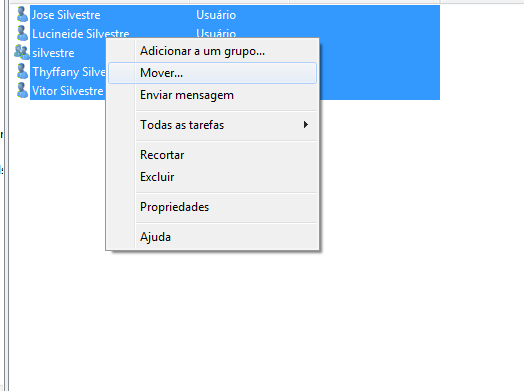
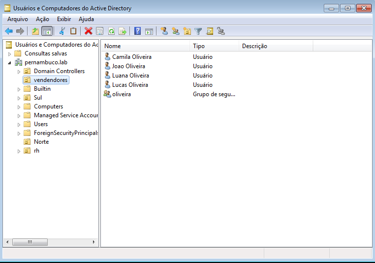
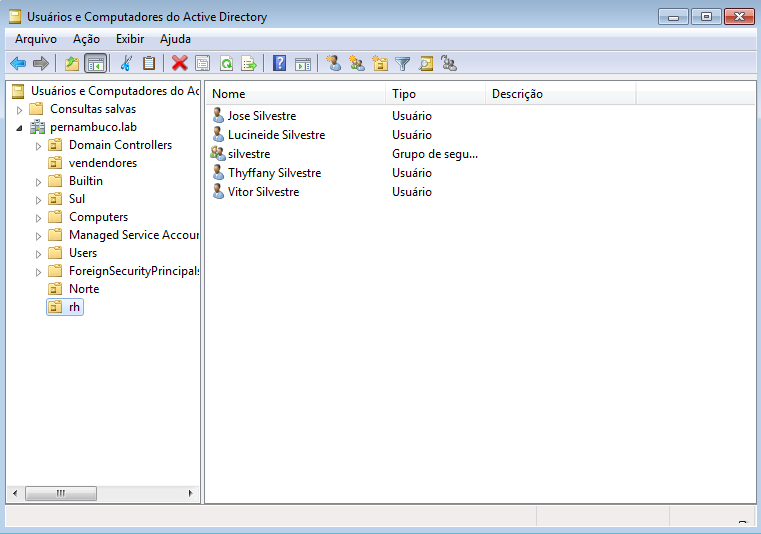
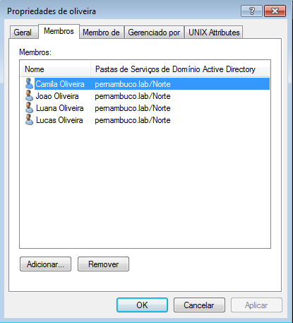

# LDAP

## Instalação
É preciso de uma máquina virtual linux com o samba e uma maquina com windowns 7 para se comunicar com o samba;

Para instalar o samba na maquina virtual linux você precisará dar os seguintes comandos:

`apk add samba`

## Configuração

Para configurar precisaremos colocar um nome para nossa máquina virtual

- No caso o nome ficou noronha.pernambuco.lab

E o nome do dominio

- No caso será pernambuco.lab

Para colocar o domínio na máquina virtual windows você fará o seguinte:

1 - Primeiro entre na mv linux e em /etc/network/interfaces

Lá você define o ip estatico para a interface desejada.

2 - Depois acesse propriedades de protocolo TCP/IP Ipv4 e configure a rede

Desta maneira:

Depois disso vá em "Painel de controle" > "Sistema e Segurança" > "Sistema" > "Alterar configurações"

Você abrirá uma aba de propriedades do sistema, nela você pode alterar o nome da máquina e definir um domínio para acessar.

Após definir o domínio "pernambuco.lab" você conseguirá acessar o servidor samba que está na máquina linux da sua maquina virtual linux.

#### Agora vamos criar as OUs

Para criar uma nova OU (Unidade Organizacional) vamos na maquina windows, procure no barra de pesquina por "Usuários e Computadores do Active Diretory"

Ao acessar você vera algumas OUs padrão do domínio pernambuco.lab.

Clique numa pasta de nome "Unidade Organizacional", ou clique com o botão direito do mouse que você verá a opção.

Crie duas OUs, uma de nome "vendedores" e outra de nome "rh"

#### Movendo o grupo pela interface gráfica

Para mover o grupos para as novas OUs bas clicar com o botão direito do mouse, selecionar "Mover" e direcionar o destino.

Desse geito:

## Testes

As OUs "vendedores" e "rh" ficarão desse geitos com os respequitivos usuários;

E adicionando usuários nos grupos ficará da seguinte forma; 

