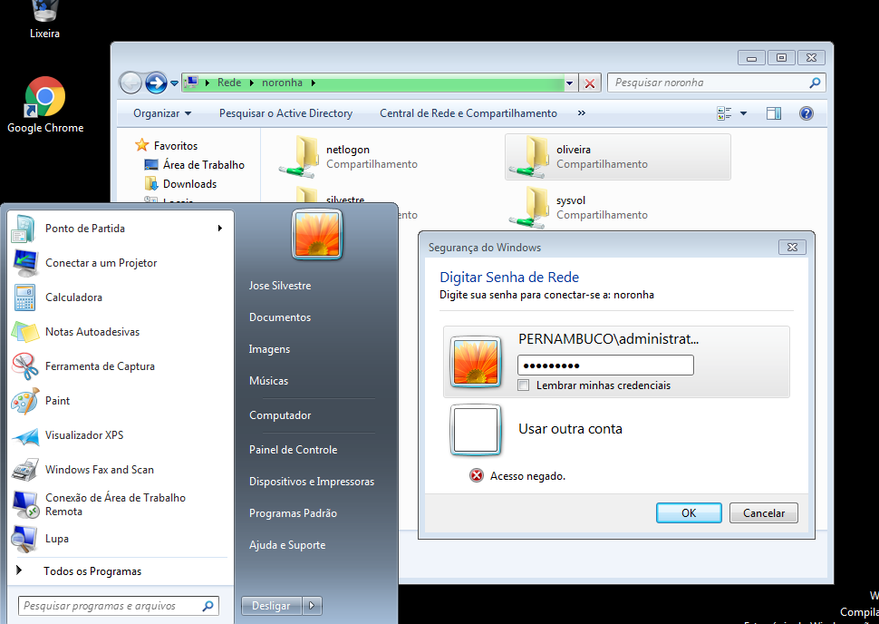

# SMB

## Instalação

É preciso de uma máquina virtual linux com o samba e uma maquina com windowns 7 para se comunicar com o samba;

Para instalar o samba na maquina virtual linux você precisará dar os seguintes comandos:

`apk add samba`


## Configuração

#### Criando os grupos

*Dentro da OU `vendedores` vamos criar o grupo `oliveira`
*Dentro da OU `rh` vamos criar o grupo `silvestre`

Para criar os grupos basta clicar com o botão direito do mouse, depois em "novo" e "grupo"

#### Criando os usuários

Para cada pasta vamos criar 4 usuários, para criar os usuários clicamos com o botão direito do mouse, "Novo" > "Usuário"


Após criar todos os usuários.

Ficarão dessa forma:


Depois basta adicionar os usuários de cada pasta dentro de seu grupo.

Para fazer isso, basta selecionar todos os usuários, clicar com o botão direito do mouse e "Adicionar a um grupo"

Lá basta digitar o nome do grupo que você deseja.

Eles ficarão assim:


#### Criando pastas compartilhada

Para criar as pastas compartilhadas para esses grupos vamo na mv linux e usamos o código:

```sh
mkdir /srv/samba/oliveira
mkdir /srv/samba/silvestre
```


serão criadas pastas no serviço samba e elas serão configuradas da seguinte forma:

acessando o aquivo "/etc/samba/smb.conf"


após isso é só entrar na máquina windows, digitar o comando "\\noronha" que é o nome da máquina e ver as pastas compartilhadas. 

Elas só poderão ser acessadas pelos usuários especificos de cada grupo.

## Testes


-   Se tentar acessar a pasta com um usuário de um outro grupo, aparecerá essa mensagem:




